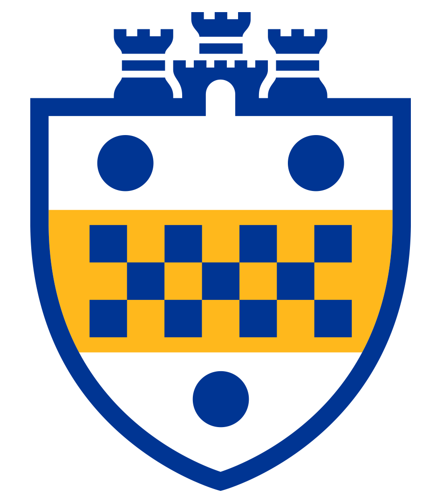
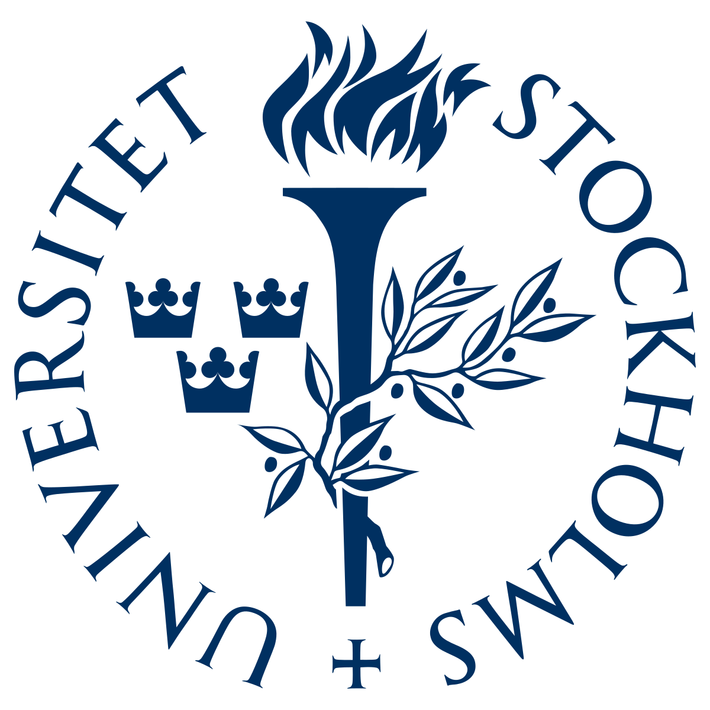
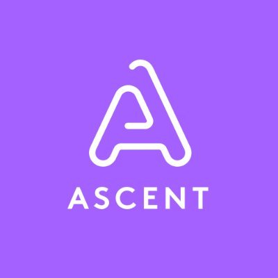

Hello! I am an incoming Ph.D. student at the [School of Computing and Information](https://www.sci.pitt.edu/), [University of Pittsburgh](https://pitt.edu/). I shall be working under the guidance of [Prof. Yu-Ru Lin](http://www.yurulin.com/) within the [Computational Social Dynamics Lab](https://picsolab.github.io/).

My research interests encompass the fields of computational social science and natural language processing. I aim to contribute to the development of responsible AI technologies that aim to bridge social divides. The research questions that particularly intrigue me, each informing the next, are as follows:

<ol>
  <li>How does the study of language use inform our understanding of human social behaviour?</li>
  <li>How can we build NLP applications that cater for the needs of marginalised populations and diverse backgrounds?</li>
  <li>How can we apply such technologies to steer communities towards improving their well-being, including but not limited to improving their mental health and mitigate conflicts?</li>
</ol>

I have previously graduated with a master’s in AI from Stockholm University, where I worked with a Ph.D student from Spotify to investigate how podcast comprehension can be improved using a pipeline combining topic segmentation and text summarisation methods. I was advised by [Prof. Panagiotis Papapetrou](https://papapetrou.blogs.dsv.su.se/) and [Maria Movin](https://www.linkedin.com/in/mariamovin).

Before my move to Stockholm, I also completed my bachelor’s in AI at the University of Malta, where I worked with [Dr. Charlie Abela](https://www.um.edu.mt/profile/charlieabela) to explore the relationship between users’ Big Five personality traits and the social connections they create within a real-world Twitter network.

## Education

    

        
    

    

        
<strong>To start Sep. 2024</strong>, Department of Informatics and Networked Systems, <strong>University of Pittsburgh</strong>,

        
Doctor of Philosophy in Information Science (Expected).

    

    

        
    

    

        
<strong>Aug. 2021 - Jun. 2022</strong>, Department of Computer and Systems Sciences, <strong>Stockholm University</strong>,

        
Master of Science in Computer and System Sciences, Artificial Intelligence.

    

    

        
    

    

        
<strong>Oct. 2018 - Jun. 2021</strong>, Department of Artificial Intelligence, <strong>University of Malta</strong>,

        
Bachelor of Science in Information Technology, Artificial Intelligence (with First Class honours).

    

## Industry Experience

    

        
    

    

        
<strong>Sep. 2023 - Present</strong>, Backend Team, <strong>Loqus Business Intelligence</strong>,

        
Artificial Intelligence Engineer.

    

    

        
    

    

        
<strong>Nov. 2022 - May 2023</strong>, Data Team, <strong>Sambla</strong>,

        
Data Scientist.

    

    

        
    

    

        
<strong>Jul. 2019 - Apr. 2020, Jul. 2021 - Aug. 2021</strong>, Student Internship, <strong>Ascent</strong>,

        
Junior Software Engineer / Junior Data Scientist.

    

    

        
    

    

        
<strong>Jul. 2020 - Sep. 2020</strong>, Department of Artificial Intelligence, <strong>University of Malta</strong>,

        
Software Engineer Apprentice.

    

## Publications



## A bit about me

🏝️ I'm from a very small island in the Mediterranean called Malta. It's a beautiful country, you should come visit! [If you're considering a trip, my friend's website has some great information.](https://www.todoinmalta.com/)

🕹️ My all-time favourite video game has to be the original Deus Ex. One of the best stories ever told in a game. I served as a beta tester for an overhaul mod called [Deus Ex: Revision](https://store.steampowered.com/app/397550/Deus_Ex_Revision/), which I highly recommend.

👁️ I have mild red-green colour blindness. Go figure.

🐧 I used to have a blog about Club Penguin when I was 12. I had even convinced my mum to buy me a .com domain for it! It was a simpler time.

🍫 A hill I'd die on? Mint chocolate is humanity's greatest mistake.

🌳 Living in Sweden for a couple of years made me realise how much I value proximity to nature. Nothing better than a walk in the woods to clear your head.

🚵 I learnt how to ride a bike at the age of 23. Never too late to learn!
