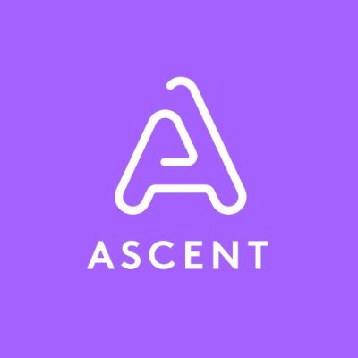

<nav class="site-nav">
  <a href="#" class="nav-link" id="nav-about" data-view="home">About</a>
  |
  <a href="#" class="nav-link" id="nav-blog" data-view="blog">Blog</a>
  <button type="button" class="theme-toggle" id="theme-toggle" aria-label="Toggle light and dark mode" aria-pressed="false">
    <svg class="tt-svg" viewBox="0 0 72 44" width="56" height="34" aria-hidden="true" focusable="false">
      <defs>
        <clipPath id="tt-horizon-clip"><rect x="-6" y="0" width="84" height="30"/></clipPath>
      </defs>
      <g clip-path="url(#tt-horizon-clip)">
        <g class="tt-sun">
          <circle cx="36" cy="30" r="9" fill="currentColor"/>
          <g class="tt-rays" stroke="currentColor" stroke-width="2.4" stroke-linecap="round">
            <line x1="36" y1="11" x2="36" y2="3"/>
            <line x1="27" y1="13" x2="24" y2="6"/>
            <line x1="45" y1="13" x2="48" y2="6"/>
            <line x1="20" y1="18" x2="14" y2="12"/>
            <line x1="52" y1="18" x2="58" y2="12"/>
            <line x1="16" y1="26" x2="9"  y2="23"/>
            <line x1="56" y1="26" x2="63" y2="23"/>
          </g>
        </g>
        <g class="tt-moon">
          <path d="M21 12.79A9 9 0 1 1 11.21 3 7 7 0 0 0 21 12.79z" fill="currentColor" transform="translate(21.6 4.8) scale(1.2)"/>
        </g>
      </g>
      <line class="tt-horizon" x1="4" y1="30" x2="68" y2="30" stroke="currentColor" stroke-width="2.6" stroke-linecap="round"/>
    </svg>
  </button>
</nav>

Hey! 👋 I'm Andrew. I am a Ph.D. student at the [School of Computing and Information](https://www.sci.pitt.edu/), [University of Pittsburgh](https://pitt.edu/). I am grateful to be working under the guidance of [Yu-Ru Lin](http://www.yurulin.com/).

My research examines how socially-aware NLP systems assess and affect users' mental well-being. I've been studying this by investigating the [socially situated nature of psychological distress](https://osf.io/3wnyz/overview), the way language models [support users over multi-turn conversations](https://arxiv.org/abs/2604.17079), and the [risk scenarios that make chatbots harmful](https://arxiv.org/abs/2606.00975).

Outside of research, I'm into [music](#what-am-i-listening-to), cooking, exploring new places... and anything creative to be honest (I've been trying out [pastel painting](assets/img/painting.jpg) lately)! I'm also from Malta, a small island in the Mediterranean. 

## Updates

* [April 2026] Excited to share that our workshop paper, ["Auditing Support Strategies in LLMs through Grounded Multi-Turn Social Simulation"](https://arxiv.org/abs/2604.17079), has been selected for an oral presentation at the SocialLLM Workshop at ICWSM 2026! 🎉 See you in LA!
* [May 2025] [Collaborated at SICSS-CMU](https://sicss.io/2025/cmu/people#:~:text=less%20impactful%20efforts.-,Andrew%20Aquilina,-Andrew%20Aquilina%20is) with an interdisciplinary team to analyse how political perceptions of AI shifted before and after ChatGPT's launch.
* [March 2025] Presented my first Ph.D. project as a poster at the [Johns Hopkins Data Science and AI Institute Spring 2025 Symposium](assets/img/poster.jpg)!

## Education

    

        
    

    

        
<strong>Aug. 2024 - Apr. 2029 (Expected)</strong>, Department of Informatics and Networked Systems, <strong>University of Pittsburgh</strong>,

        
Doctor of Philosophy in Information Science.

    

    

        
    

    

        
<strong>Aug. 2021 - Jun. 2022</strong>, Department of Computer and Systems Sciences, <strong>Stockholm University</strong>,

        
Master of Science in Computer and System Sciences, Artificial Intelligence.

    

    

        
    

    

        
<strong>Oct. 2018 - Jun. 2021</strong>, Department of Artificial Intelligence, <strong>University of Malta</strong>,

        
Bachelor of Science in Information Technology, Artificial Intelligence (with First Class honours).

    

<!--
## Industry Experience

    

        
    

    

        
<strong>Sep. 2023 - Jul. 2024</strong>, Backend Team, <strong>Loqus Business Intelligence</strong>,

        
Artificial Intelligence Engineer.

    

    

        
    

    

        
<strong>Nov. 2022 - May 2023</strong>, Data Team, <strong>Sambla</strong>,

        
Data Scientist.

    

    

        
    

    

        
<strong>Jul. 2019 - Apr. 2020, Jul. 2021 - Aug. 2021</strong>, Student Internship, <strong>Ascent</strong>,

        
Junior Software Engineer / Junior Data Scientist.

    

    

        
    

    

        
<strong>Jul. 2020 - Sep. 2020</strong>, Department of Artificial Intelligence, <strong>University of Malta</strong>,

        
Software Engineer Apprentice.

    

-->

## Papers



#### Favourite song right now? {#what-am-i-listening-to}

  
🎵

  
Lately I've been listening to … (from my Spotify)

  <h2>Blog</h2>
  

    This is a space for my thoughts, research notes, and things I've been learning. Most importantly, it is a no AI zone 🚫 - meaning I cannot use it to ideate, draft, write, or proofread for me. It is organic! 🌱
  

  

    
    
      <ul class="blog-list" id="blog-list">
        
        <li class="blog-list-item">
          <a href="#" class="blog-list-link" data-index="{{ forloop.index0 }}">
            {{ post.title }}
            <time class="blog-list-date">{{ post.date | date: "%B %-d, %Y" }}</time>
          </a>
        </li>
        
      </ul>
      

        <a href="#" class="blog-back" id="blog-back">&larr; All posts</a>
        
        <article class="blog-article" data-index="{{ forloop.index0 }}">
          <h3 class="article-title">{{ post.title }}</h3>
          <time class="article-date">{{ post.date | date: "%B %-d, %Y" }}</time>
          {{ post.content }}
        </article>
        
      

    
      
No articles yet — check back soon!

    
  

